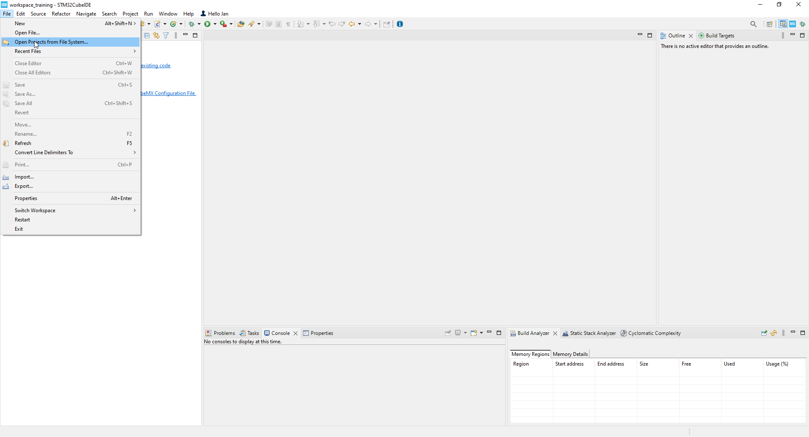
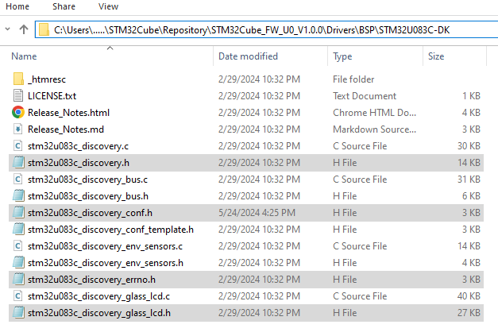

//----!
Presentation
----!

# CubeIDE
- Open **CubeIDE** and related `Unit_Measure` project



# Include Board Support Package and LowLayer library
<awarning>
BSP library helps to control Glass LCD display. Please note, that BSP library is based on HAL library and not well optimized for low power application. However, we stay with that for simplicity.
</awarning>
<p> </p>

Copy paste following snippet in `USER CODE BEGIN Includes` section in **main.h** file:

```c
#include "stm32u083c_discovery_glass_lcd.h"
#include "stm32u083c_discovery.h"
#include "stm32u083c_discovery_conf.h"
#include "stm32u083c_discovery_errno.h"

#include "stm32u0xx_ll_dma.h"
#include "stm32u0xx_ll_lptim.h"
#include "stm32u0xx_ll_rtc.h"
```
<br />
Uncomment **HAL_LCD_MODULE_ENABLED** in `stm32u0xx_hal_conf.h` to be able operate with LCD BSP library.

```c
#define HAL_LCD_MODULE_ENABLED
```
<br />

Drag and drop listed header files from `C:\Users\...\STM32Cube\Repository\STM32Cube_FW_U0_V1.0.0\Drivers\BSP\STM32U083C-DK` in to `Inc` folder of the project.

- `stm32u083c_discovery_glass_lcd.h`
- `stm32u083c_discovery.h`
- `stm32u083c_discovery_conf.h`
- `stm32u083c_discovery_errno.h`



# Include Board Support Package and LowLayer library 2

Drag and drop listed c file from `C:\Users\...\STM32Cube\Repository\STM32Cube_FW_U0_V1.0.0\Drivers\BSP\STM32U083C-DK` in to `Src` folder of the project.

- `stm32u083c_discovery_glass_lcd.c`

<br />

Drag and drop listed header file from `C:\Users\...\STM32Cube\Repository\STM32Cube_FW_U0_V1.0.0\Drivers\STM32U0xx_HAL_Driver\Inc` in to `STM32U0xx_HAL_Driver\Inc` folder of the project.

- `stm32u0xx_hal_lcd.h`

<br />

Drag and drop listed c file from `C:\Users\...\STM32Cube\Repository\STM32Cube_FW_U0_V1.0.0\Drivers\STM32U0xx_HAL_Driver\Src` in to `STM32U0xx_HAL_Driver\Src` folder of the project.

- `stm32u0xx_hal_lcd.c`

<br />

# DK Board revision
- Solder mask print MB1933x (x = A/B/C/..)

Define correct board revision in **stm32u083c_discovery.h**. Differ in assembled Glass LCD.

```c
#if !defined (USE_STM32U083C_DISCO_REVC) && !defined (USE_STM32U083C_DISCO_REVB) && !defined (USE_STM32U083C_DISCO_REVA)
#define USE_STM32U083C_DISCO_REVC
#endif
```
<br />

# Exported Functions
Copy paste following snippet in `USER CODE BEGIN EFP` section in **main.h** file:

```c
void CaptureFalling_Callback(void);
void CaptureRising_Callback(void);
void WakeUp_Callback(void);
```

# Interrupt Service Routines
Depending on periphery an ISR Callbacks based on HAL are time consuming which increase RUN time and overall consumption. 
Let skip them and use simple LL function.

## RTC ISR

**Uncomment** `HAL_RTCEx_WakeUpTimerIRQHandler(&hrtc);` callback in `RTC_TAMP_IRQHandler(void)` of **stm32u0xx_it.c** file.

```c
  /* USER CODE END RTC_TAMP_IRQn 0 */
 // HAL_RTCEx_WakeUpTimerIRQHandler(&hrtc);
  /* USER CODE BEGIN RTC_TAMP_IRQn 1 */
```

<br />

Copy paste following snippet in `USER CODE BEGIN RTC_TAMP_IRQn 1` section in **stm32u0xx_it.c** file:

```c
if (LL_RTC_IsActiveFlag_WUT(RTC) != 0)
	{
			/* Clear the Alarm interrupt pending bit */
			LL_RTC_ClearFlag_WUT(RTC);

			/* Clear the EXTI's Flag for RTC*/
			LL_EXTI_ClearRisingFlag_0_31(LL_EXTI_LINE_28);

	    WakeUp_Callback();
	}
```

## LPTIM1 ISR

**Uncomment** `HAL_LPTIM_IRQHandler(&hlptim1);` callback in `TIM6_DAC_LPTIM1_IRQHandler(void)` of **stm32u0xx_it.c** file.

```c
  /* USER CODE END TIM6_DAC_LPTIM1_IRQn 0 */
 // HAL_LPTIM_IRQHandler(&hlptim1);
  /* USER CODE BEGIN TIM6_DAC_LPTIM1_IRQn 1 */
```

<br />

Copy paste following snippet in `USER CODE BEGIN TIM6_DAC_LPTIM1_IRQn 1` section in **stm32u0xx_it.c** file:

```c
 /* Check CC1 interrupt from falling edge*/
	if(LL_LPTIM_IsActiveFlag_CC1(LPTIM1) == 1)
	{
		/* Clear the update interrupt flag*/
		LL_LPTIM_ClearFlag_CC1(LPTIM1);

	    /* TIM1 capture/compare interrupt processing(function defined in main.c) */
		CaptureFalling_Callback();
	 }
	/* Check CC1 interrupt from falling edge */
	else if (LL_LPTIM_IsActiveFlag_CC3(LPTIM1) == 1)
	{
		/* Clear the update interrupt flag*/
		LL_LPTIM_ClearFlag_CC3(LPTIM1);

	    /* TIM1 capture/compare interrupt processing(function defined in main.c) */
		CaptureRising_Callback();
	 }
	/* Clear the EXTI's Flag for LPTIM1*/
	LL_EXTI_ClearRisingFlag_0_31(LL_EXTI_LINE_24);
```

# Initialization
## Variables
Copy paste following snippet in `USER CODE BEGIN PV` section in **main.c** file:

```c
uint32_t newValueRise = 0;
uint32_t negDutyCycle = 0;
```
## Prototype function
Copy paste following snippet in `USER CODE BEGIN PFP` section in **main.c** file:

```c
void Convert_IntegerIntoChar(float number, uint16_t *p_tab);
```

# Initialization 2
## Reset Backup domain
Clear complete backup domain (LSE, RTC,..) in case of system reset.

Copy paste following snippet in `USER CODE BEGIN Init` section in **main.c** file:

```c
__HAL_RCC_PWR_CLK_ENABLE();
HAL_PWR_EnableBkUpAccess();
__HAL_RCC_BACKUPRESET_FORCE();
while(__HAL_RCC_GET_FLAG(RCC_FLAG_LSERDY));
__HAL_RCC_BACKUPRESET_RELEASE();
```

## Deactivate WakeUp timer
CubeMX enabled WakeUp timer immidiately during RTC init. In application flow RTC is used to update measured Duty Cycle value on Glass LCD. It must be enabled after recieveing any signal and not during initialization phase. 

Copy paste following snippet in `USER CODE BEGIN RTC_Init 2` section in **main.c** file:

```c
HAL_RTCEx_DeactivateWakeUpTimer(&hrtc);
```

# Start IPs
In this stage let add user code which launch signal measuring and display welcome words on Glass LCD.
Also put MCU in LowPower Run as System frequency = 2MHz.

Copy paste following snippet in `USER CODE BEGIN 2` section in **main.c** file:

```c
/* Initialization of LCD module */
BSP_LCD_GLASS_Init();
BSP_LCD_GLASS_Clear();

/*Enable LPRun mode, as Sysclock <2MHz and enter in Stop1 mode*/
__HAL_RCC_PWR_CLK_ENABLE();
HAL_PWREx_EnableLowPowerRunMode();

/*Launch PWM Measure*/
HAL_COMP_Start(&hcomp1);
HAL_LPTIM_IC_Start_IT(&hlptim1, LPTIM_CHANNEL_1);
HAL_LPTIM_IC_Start_IT(&hlptim1, LPTIM_CHANNEL_3);

/*Show welcome word*/
BSP_LCD_GLASS_ScrollSentence((uint8_t *)"       waiting for signal and go to STOP mode ", 1 , 149);
BSP_LCD_GLASS_Clear();

/* Reduce Vcld (Contrast Control) after scrolling text
 *  High drive and PulseOn duration already changed in BSP -> lower consumption*/
MODIFY_REG(LCD->FCR, LCD_FCR_CC, LCD_CONTRASTLEVEL_2);
while (READ_BIT(LCD->SR, LCD_SR_FCRSR) == 0);

BSP_LCD_GLASS_DisplayString((uint8_t *)"IDLE");
```

## LCD BSP modification
As BSP is adopted for Glass LCD, still some minor tunning must be placed for further consumption reduction. 
It influences contrast but still Glass LCD will be readable.
- Reduce PulseOn duration time to 1 cycle
- Avoid Low resistance R-ladder in LCD output stage

Modify two lines in `BSP_LCD_GLASS_Init()` function upper section in **stm32u083c_discovery_glass_lcd.c** file:

```c
LCDHandle.Init.PulseOnDuration  = LCD_PULSEONDURATION_1; //LCD_PULSEONDURATION_4
LCDHandle.Init.HighDrive        = LCD_HIGHDRIVE_DISABLE; //LCD_HIGHDRIVE_ENABLE
```

## Stop mode
Enter in Stop mode. Selected Stop1 mode is due to possible transition between LPRun <-> Stop1. Transition between LPRun <-> Stop2 is not allowed deu to Main regulaotr is off. Please chekc Refference Manual. 

Copy paste following snippet in while (1) `USER CODE BEGIN WHILE` section in **main.c** file:

```c
/*Enter in STOPx mode*/
HAL_PWREx_EnterSTOP1Mode(PWR_STOPENTRY_WFI);
```

# ISR Callback
Incoming signal is proccesed once device wakeups from Stop mode in ISR callbacks.

## LPTIM1 Callbacks
ISR for Falling edges from CH1_LPTIM1 and calculate and display duty cycle of negative pulse.
Also handle 1s TimeOut on bus line.

Adding simpler function for ISR for Rising edges from CH3_LPTIM1.

Copy paste following snippet in `USER CODE BEGIN 4` section in **main.c** file:

```c
/*ISR for Falling edges from CH1_LPTIM1 and calculate duty cycle of negative pulse
 * 
 * ____IDLE_____negDC_______
 *    		   	|	|		|	|
 *     			|___|		|___|
 * 			oldVF  newVR  newVF
 * */
void CaptureFalling_Callback(void)
{
	static uint32_t oldValueFall = 0;
	static uint32_t newValueFall = 0;
	static uint32_t DiffValueFall = 0;

	oldValueFall = newValueFall;

	newValueFall = LL_LPTIM_IC_GetCaptureCH1(LPTIM1);
	/* Capture computation */
	if (newValueFall > oldValueFall && newValueRise > oldValueFall )
	{
		DiffValueFall = (newValueFall - oldValueFall);
		negDutyCycle = (newValueRise - oldValueFall) * 100 / DiffValueFall;
	}
	else
	{
		/*
		 * For simplicity rest combination like "newValueFall < oldValueFall".... are NOT handled
		 * DiffValueFall = ((LPTIM1_ARR_MAX - oldValueFall) + newValueFall) + 1;
		*/
	}
	/*Enable RTC WakeUp*/
	/* Configure the Interrupt in the RTC_CR register and Enable the Wakeup Timer*/
	LL_RTC_EnableIT_WUT(RTC);
	LL_RTC_WAKEUP_Enable(RTC);
}
  /*ISR for Rising edges from CH3_LPTIM1 and calculate duty cycle of negative pulse*/
void CaptureRising_Callback(void)
{
	newValueRise = LL_LPTIM_IC_GetCaptureCH3(LPTIM1);
}
```

## RTC Callbacks
ISR from 1s periodic WakeUp timer update Glass LCD with duty cycle of negative pulse.
Also handle 1s TimeOut on bus line.
Adding helper fucntion which convert Integer (measured Duty Cycle) into Char which can be displayed on Glass LCD.

Copy paste following snippet in `USER CODE BEGIN 4` section in **main.c** file:

```c
/*ISR from 1s periodic timer*/
void WakeUp_Callback(void)
{
	static uint32_t actValueRise = 0;
	static uint32_t preValueRise = 0;
	static uint16_t tab[6];
	/*Time out for IDLE state on bus*/
	preValueRise = actValueRise;
	actValueRise = LL_LPTIM_IC_GetCaptureCH3(LPTIM1);
	
	/*1s TimeOut for IDLE state on bus -> display Measured duty cycle or "IDLE*/
	if(preValueRise != actValueRise)
	{
		Convert_IntegerIntoChar(negDutyCycle, (uint16_t *)tab);
		tab[0] = 0x44; //"D"
		tab[1] = 0x75; //"u"
		tab[2] = 0x43; //"C"
		tab[2] |= DOUBLE_DOT ; //add double dot
		tab[3] = 0x30; //"C"
	}
	else
	{
		/*no captured edges on bus ->Display IDLE state*/
		tab[0] = 0x49; //"I"
		tab[1] = 0x44; //"D"
		tab[2] = 0x4C; //"L"
		tab[3] = 0x45; //"E"
		tab[4] = ' ';  //' '
		tab[5] = ' ';  //' '

		/* reset DutyCycle and enter in Stop mode*/
		negDutyCycle = 0;

	    /*Disable RTC WakeUp Interrupt*/
	    LL_RTC_DisableIT_WUT(RTC);
	    LL_RTC_WAKEUP_Disable(RTC);
		}
	/*Display processed signal*/
	BSP_LCD_GLASS_Clear();
	BSP_LCD_GLASS_DisplayStrDeci(tab);

}

void  Convert_IntegerIntoChar(float number, uint16_t *p_tab)
{
  uint16_t units=0, tens=0; // hundreds=0, thousands=0, tenthousand=0, hundredthousand=0;

  uint32_t number1 = (uint32_t) number;

  units = ((((number1%100000)%10000)%1000)%100)%10;
  tens = (((((number1-units)/10)%10000)%1000)%100)%10;
 // hundreds = ((((number1-tens-units)/100)%1000)%100)%10;
 //thousands = (((number1-hundreds-tens-units)/1000)%100)%10;
 //tenthousand = ((number1-thousands-hundreds-tens-units)/10000)%10;
 //hundredthousand = ((number1-tenthousand-thousands-hundreds-tens-units)/100000);

  *(p_tab+5) = units + 0x30;
  *(p_tab+4) = tens + 0x30;
  //*(p_tab+3) = hundreds + 0x30;
  //*(p_tab+2) = thousands + 0x30;
  //*(p_tab+1) = tenthousand + 0x30;
  //*(p_tab+0) = hundredthousand + 0x30;
}
```