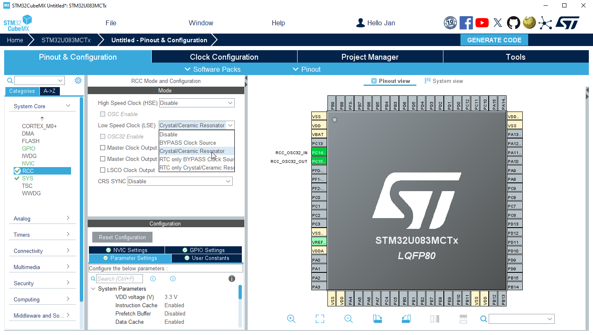
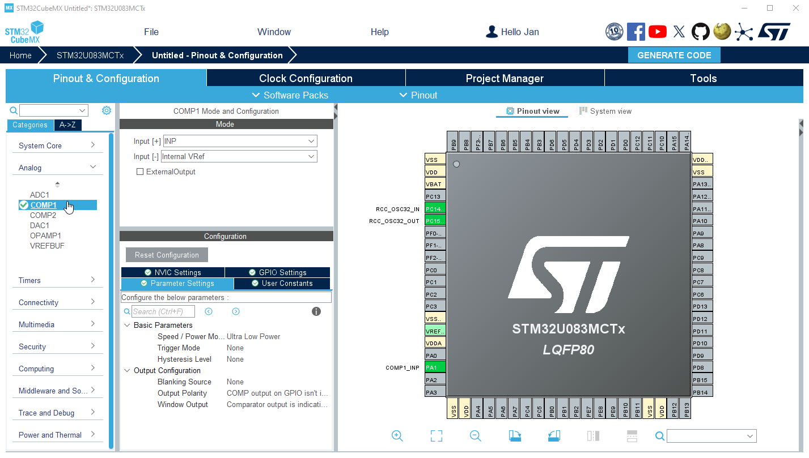
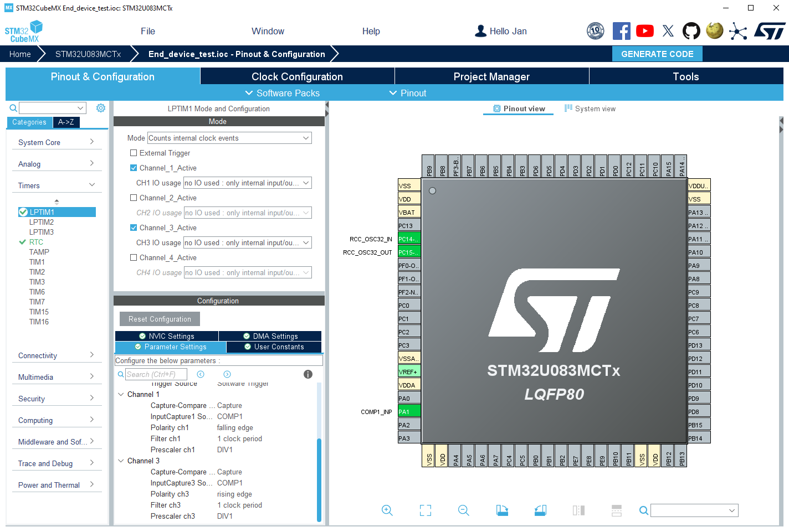
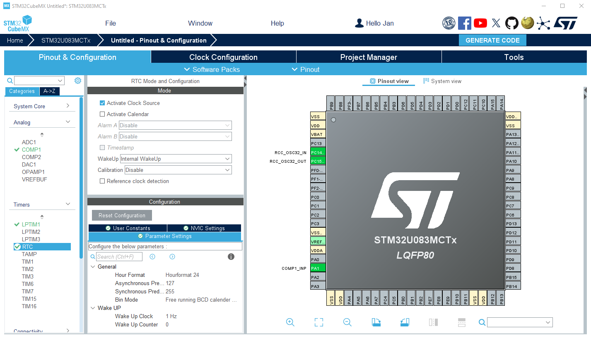
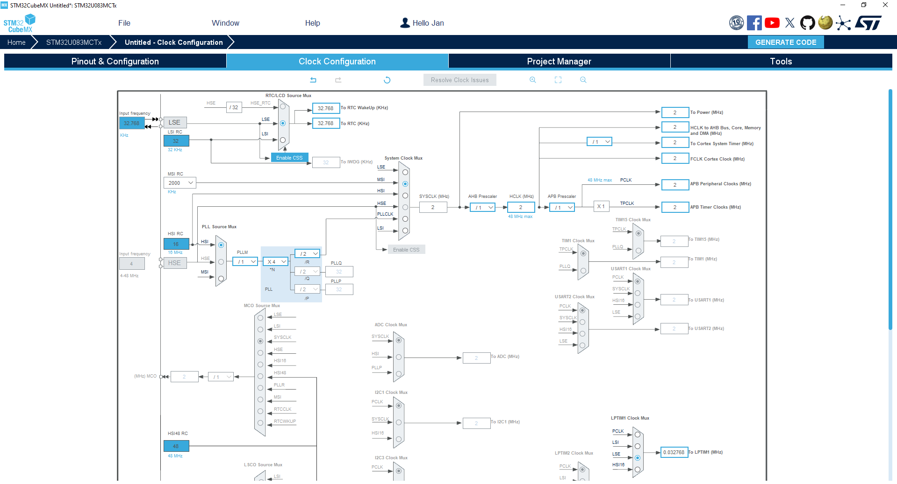
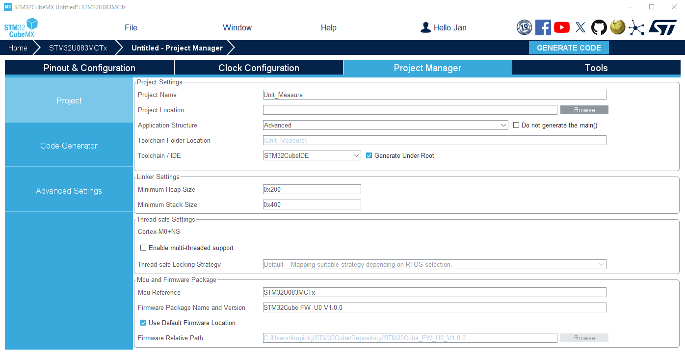

----!
Presentation
----!

# LSE crystal
- Configure Low Speed Clock `Crystal/Ceramic Resonator`

# COMPARATOR
- Select **COMP1** instance.

- Configure Input[+] as `INP`. Signal will be connected to PA1 (A1 in CN8 connector on DK board)

- Configure Input[-] as `Internal VRef`. Comparison level is set ~1.2V then

- In **Parameter Setting** select `Ultra Low Power` for Speed/Power mode
  

# Low Power Timer
To be able catch signal edge down to Stop modes. LPTIM1 and LSE cooperates together.

- Select **LPTIM1** instance
  
- Configure `Counts internal clock events` mode
  
- Activate `Channel_1` and `Channel_2` both in default `no IO used: ....`

- Channel 1 Parameter Settings:
  - `Capture`
  - `COMP1` as Input Capture source
  - `Falling edge` for Polarity ch1 

- Channel 3 Parameter Settings:
  - `Capture`
  - `COMP1` as Input Capture source
  - `Rising edge` for Polarity ch3 
  
- Enable `TIM6, DAC, LPTIM1 Global Interrupts` in NVIC Setting tab

# RealTime Clock unit
Application periodically wakeups from Stop modes and refresh LCD glass display.

- Select **RTC** instance
  
- Tick `Activate Clock Source`

- Select `Internal WakeUp` for WakeUp option
  
- Set `Wake Up clock to 1Hz` base
  
-  Keep `counter to 0`. Periodic wake up event occurs every 1 second
  
- Enable `RTC non-secure interrupt` in NVIC Setting tab

# Clock Configuration
- Change **MSI RC** to `2 MHz` and select MSI as `System Clock`
  
- Select **LSE** as source for `RTC/LCD`

- Select **LSE** as source for `LPTIM1`. 

  

# Project Manager
Project is now configured.

- Select **CubeIDE Toolchain**

- Write project name and `Generate Code`
  

  