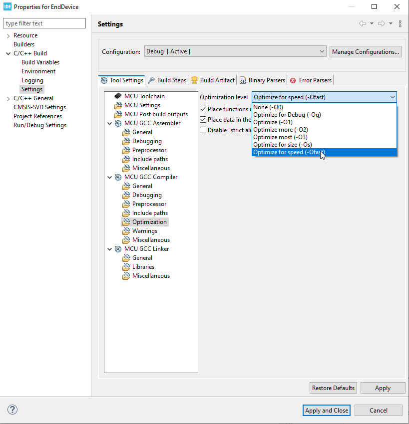
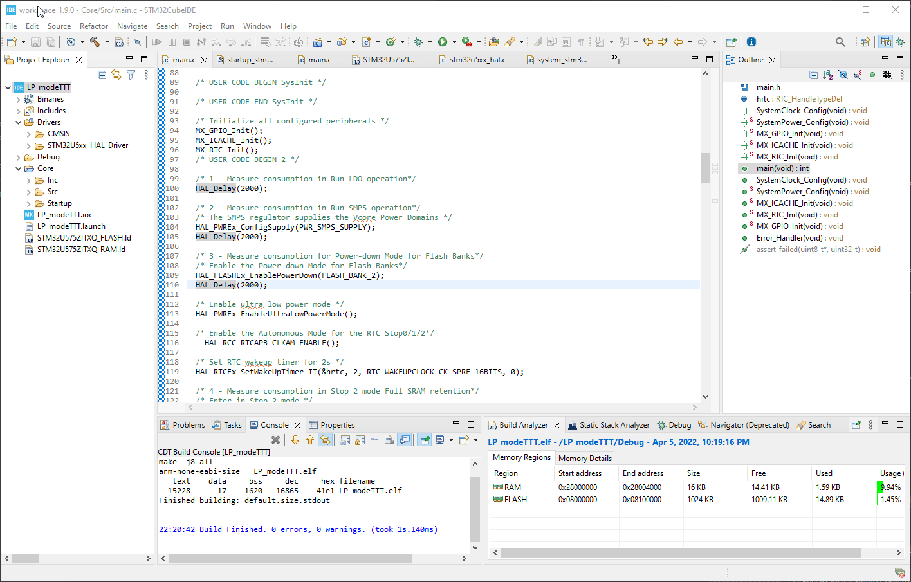
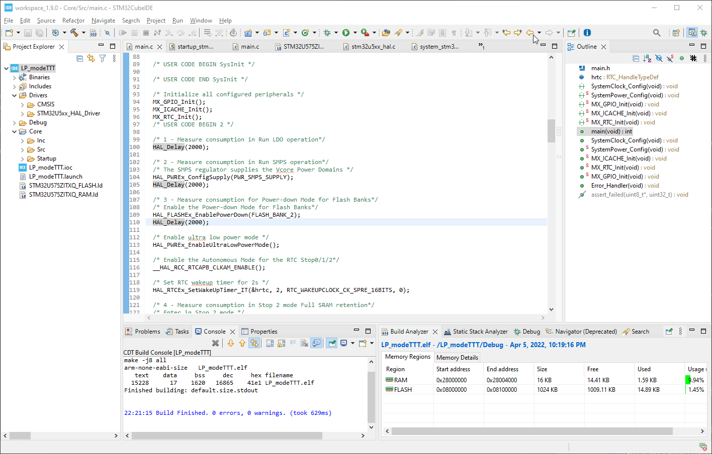
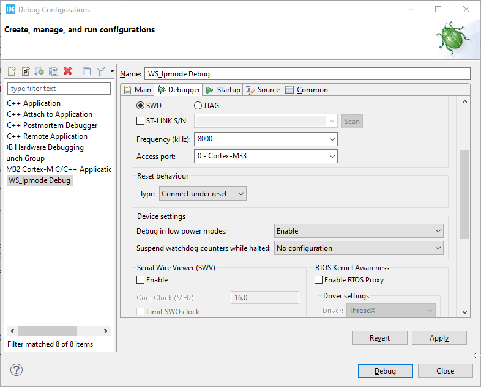
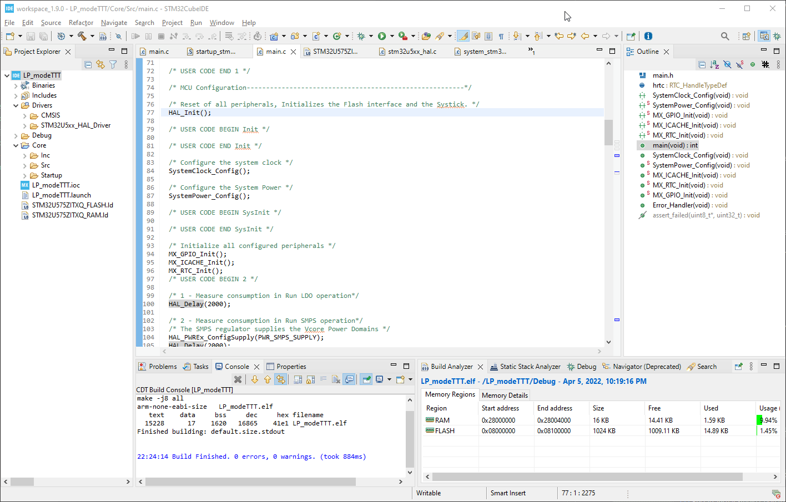
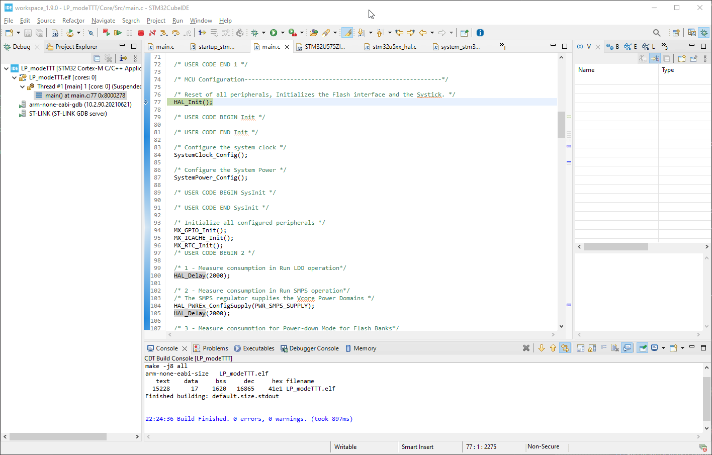

----!
Presentation
----!
# Compile Code with optimization

 

To reduce time spent in Run mode (ISR) compile code for speed.

 

Go to `Project - Properties - C/C++ Build - Settings - MCU GCC Compiler - Optimization`

- select `Optimize for speed (-Ofast)`
- click `Apply and Close`

 

# Compile Code

 

# Debug configuration
<awarning> 
Disable Debug in Low Power modes. Otherwise MCU does no enter in genuine LP modes.
</awarning>

 

- Debug configurations window is opened during first debug session or open it manually.

 

 

- **Disable Debug** in Low Power modes.

 

# Flash device 

 

# Terminate debug session

 

<awarning> 
To avoid extra consumption.
</awarning>

 

  