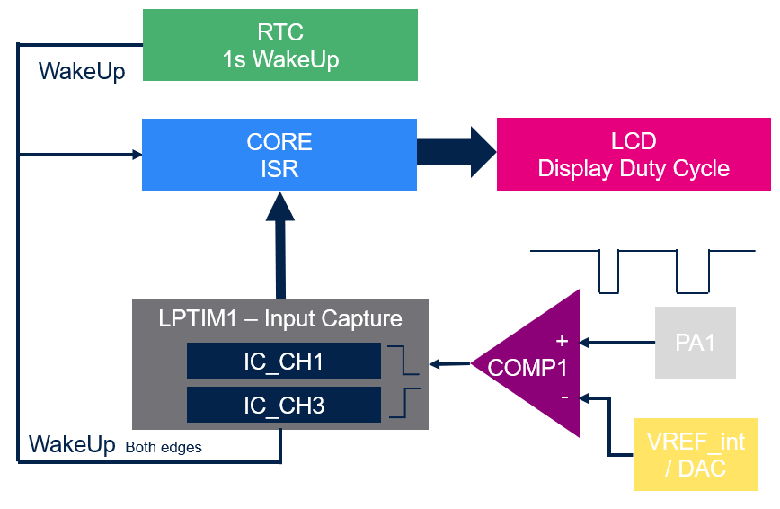
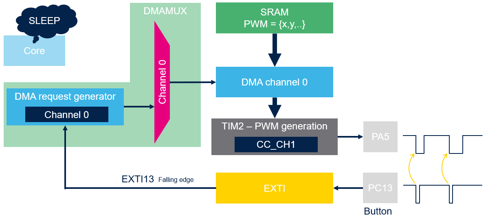

----!
Presentation
----!
# ???
Let imagine simple BUS architecture one MASTER panel and multiple End device.

- Two wired BUS DC power supply + Vss
- Data stream are modulated as Edges in power line
- Defined Low pulse widths for 1/0 bit in range hundred of microseconds to few miliseconds

# End device

- Supplied from BUS and continuously decoding stream on BUS
- Depends on timing requirements End device combining Sleep/Stop modes
- Need also provide asnwers back to power line
- Pulse can be very distorted
  

## In a Workshop

- Use **STM32U83-DK** board
- Device not supplied from BUS (it would required extra power supply)
- Measure incoming signal by LPTIM with external LSE(quartz) crystal
- Re-shape edges by internal **Comparator**
- Between edges and during Idle state on BUS the device enter in STOP mode
- Run simple data process
- Duty cycle of low pulse is displayed on **Glass LCD**
- Manage TimeOut with RTC unit when no TX acitivity on BUS
- Monitor consumption profile in **STM32CubeMonitor-Power**

# Master panel

- Power bus with limited current
- Transmit messages and expeceted answer within defined time window

## In a Workshop

- Use **STM32U83-NUCLEO** board
- Generate low pulse with various duty cycle thanks TIMER in PWM mode
- PWM duty cycle reconfiguration done in background mode by DMA transfer after button press
- 0% duty cycle simulates IDLE state on BUS
- Duty cycle is monitored on LED dimming
- Manage TimeOut with RTC unit when no TX acitivity on BUS
- MCU never wakeup and can run at very low freguency (down to 100 kHz)
- Optionally consumption profile can be verified in **STM32CubeMonitor-Power**
  
