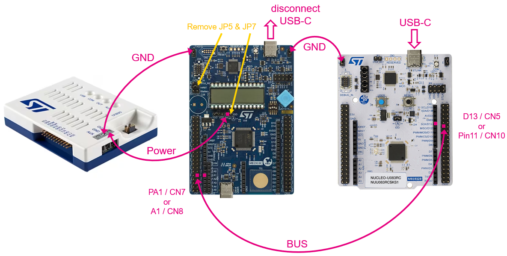
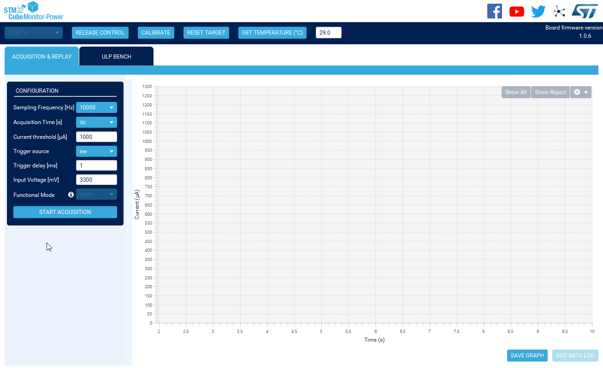

----!
Presentation
----!
# Power Monitor
STLINK-V3PWR is a two-in-one standalone debugger probe and a source measurement unit (SMU) designed to synchronize code execution with a power consumption of STM32 applications in real time. This tool is specifically adapted for power consumption optimization.

- Programmable voltage source from 1.6 to 3.6 V
- sampling rate up to 100 kSpS
- Dynamic measurement: few nA to 500 mA current
- Auxiliary output voltage source from 1.6 to 3.6 V under up to 2 A 
- JTAG / Serial Wire Debug
- UART interface on Virtual COM port (VCP)
- Multipath bridge USB to SPI/I2C/CAN/GPIOs

 

# STLINK-V3PWR
- Connect **two wires in position OUT & GND** as shown in picture below. 

<ainfo>
Wires can be optionally twisted to reduce noise.
</ainfo> 

 

# Connect STLINK-V3PWR
- [Install](https://www.st.com/en/development-tools/stm32cubemonpwr.html) and launch **STM32CubeMonitor-Power**

- Select **Virtual Comport** associated to STLINK-V3PWR power measuring feature.

- Press **Take Control**.

# Wiring diagram to STM32U83-DK board
- **Remove JP5** nad **JP7** on DK board

- Connect wires to **GND** and left **Pin 2** of **JP7**
  
- Disconnect USB-C from DK board to avoid small leakage current (unprecise current measuring) due to second ground reference.

 

- or **Connect A-meter** to Pin 1 & 2 of JP7. Then keep DK board power from USB-C and do not disconnect it. 
  

# Configuration
In Configuration window many parameters can be adjusted. For hands-on purpose let select:

- **Sampling frequency to 10kHz** to get adequate resolution

- **Acquisition time set to infinitive** – endless data recording

- Keep **3300mV** as output voltage level

- Press **POWER ON** - both LEDs (AUX and OUT) light Green

- **Start Acquisition**

# Show report
- FULL and SELECT FRAME consumption details (Min, Max, Average, Energy)
- Acquisition must be **stopped**
- Press **Show Report**

