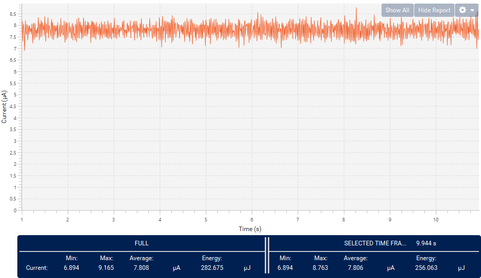
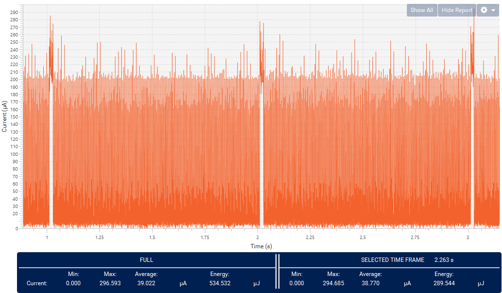
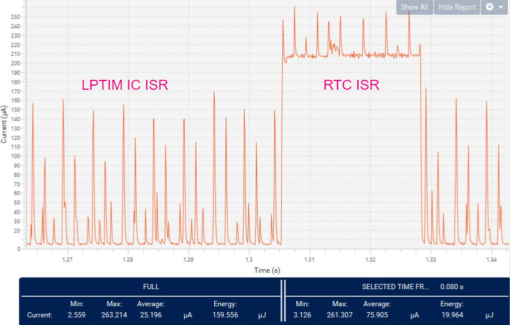

----!
Presentation
----!
# Test Functionality
Check functionlaity we developt in past 90 minutes!

- Supply DK board
- Reset Nucelo board by reset button - to be sure BUS is in IDLE state
- Connect Nucleo to DK board
- Reset DK board - welcome message is scrolling
- After press user (blue) button on Master Panel (Nucleo) the End Device(DK) shows state on BUS (IDLE or Duty Cycle of Low pulse 15/30/45 %)

# Measured consumption
## Measure consumption in IDLE state on BUS
- Average consumption in **IDLE ~8.7uA** STOP1, driving LCD, keep LPTIM and RTC active

## Measure consumption in non-IDLE state on BUS

- Average consumption once pulses occur on BUS **non-IDLE ~39uA** combination STOP1 + LP Run in ISR, process data

- Detail focused on ISR from LPTIM_IC and RTC wake 

