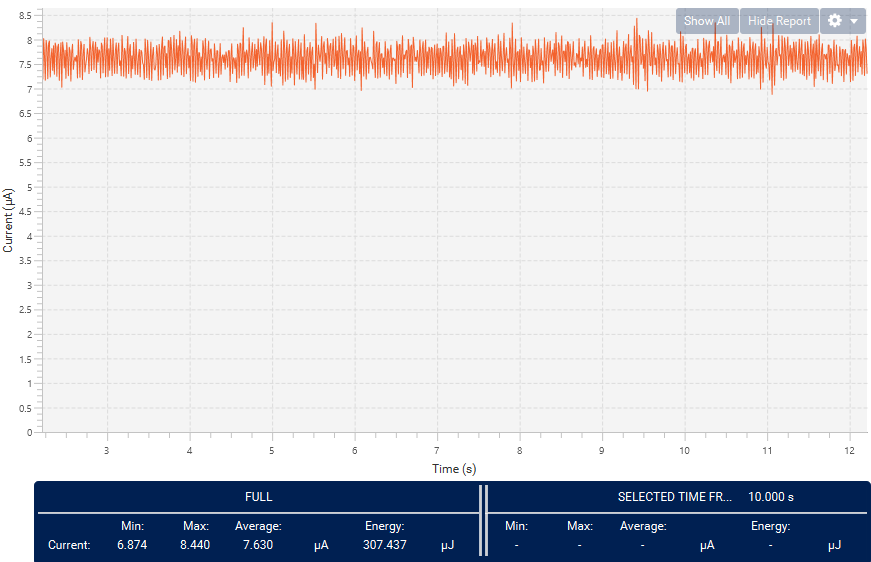

----!
Presentation
----!
# Test Functionality
Check full application we developed in past 90 minutes!

- Supply DK board
- Reset Nucleo board by reset button - to be sure BUS is in IDLE state
- Connect Nucleo to DK board
- Reset DK board - welcome message is scrolling
- After press user (blue) button on Master Panel (Nucleo) the End Device(DK) shows state on BUS (IDLE or Duty Cycle of Low pulse 20/40/60 %)

# Measured consumption
## Measure consumption in IDLE state on BUS
- Average consumption in **IDLE ~8 uA** STOP1, driving LCD, keep LPTIM and RTC active

## Measure consumption in non-IDLE state on BUS

- Average consumption once pulses occur on BUS **non-IDLE ~26 uA** combination STOP1 + LP Run in ISR, process data

- Detail focused on current peaks caused by Interrupt service routine from LPTIM Input Capture and RTC WakeUp

