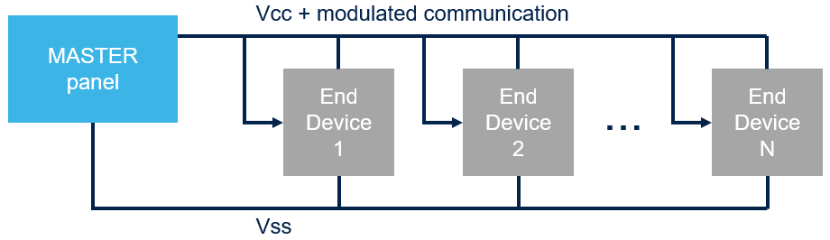
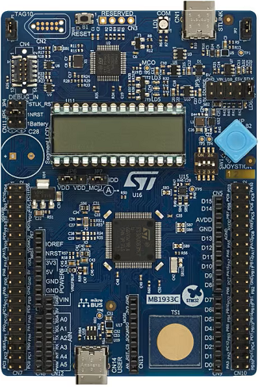

----!
Presentation
----!

# Wired BUS Architecture
Let imagine simple BUS architecture one Master Panel and multiple End devices.

- Two wires BUS 
    - DC power supply + communication
    - VSS
- Data stream are modulated as Edges in power line
- Defined Low pulse widths for 1/0 bit in range hundred of microseconds to few miliseconds
- Proprietary protocol
    - typically start bit + data + stop bits

# Prerequisites
- Software:
  - **[STM32CubeMX](https://www.st.com/en/development-tools/stm32cubemx.html)** from version 6.11.0
  - **[STM32CubeIDE](https://www.st.com/en/development-tools/stm32cubeide.html)** from version 1.15.1
  - **[STM32U0 Cube library](https://www.st.com/en/embedded-software/stm32cubeu0.html)** from version 1.0.0
  - **[STM32Cube Monitor Power](https://www.st.com/en/development-tools/stm32cubemonpwr.html)** from version 1.2.1
 
- Hardware:

  - **2 USB-C** cables 
   
  - **2 female-female wires** (min 10cm length) to connect header pins 
   
  - **[NUCLEO-U083RC](https://www.st.com/en/evaluation-tools/nucleo-u083rc.html)** board (??? Can be ordered after session for special price?? or something else???)
   
  
   
  - **[STM32U083C-DK](https://www.st.com/en/evaluation-tools/stm32u083c-dk.html)** board (??? Can be ordered after session for special price?? or something else???)
   
  
   
  - Alternatively you can take your own multimeter with 1uA current measurement range
   

