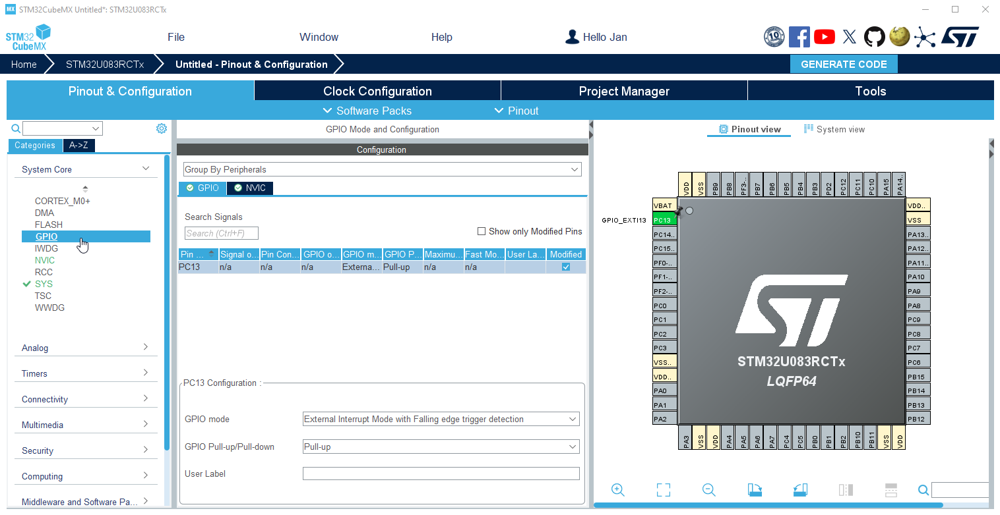
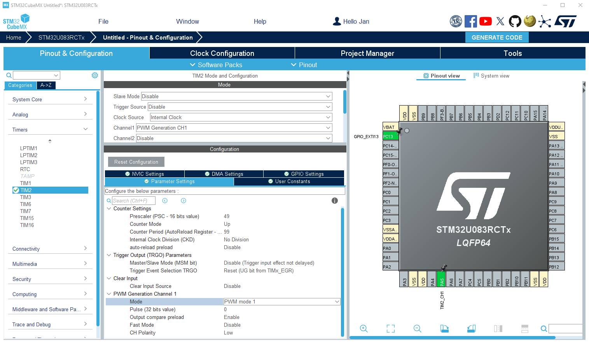
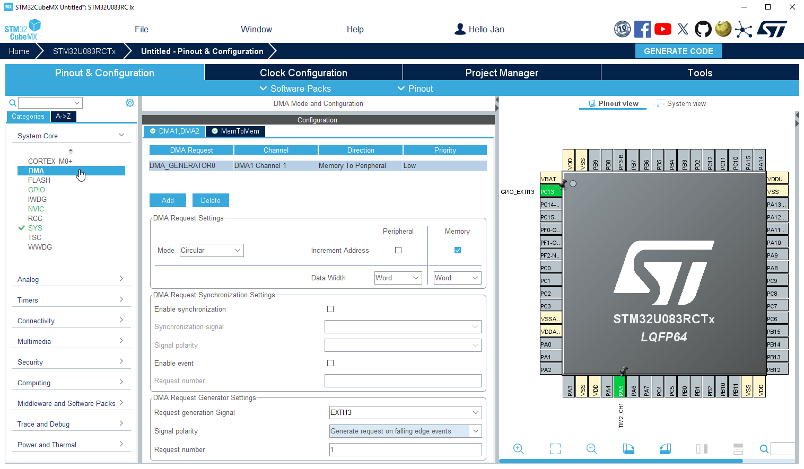
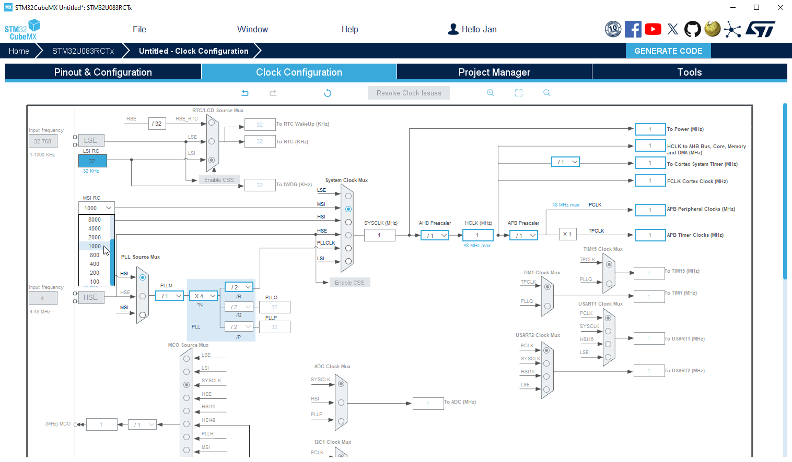
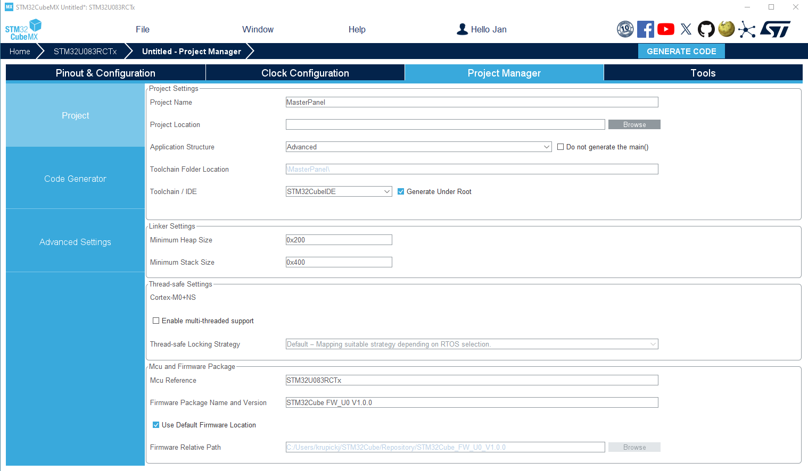

----!
Presentation
----!

# User Button

- Configure **PC13** as `GPIO_EXTI13`
- Configure **PA5** as `TIM2_CH1` - Green LED connected

Under **GPIO** tab modify PC13:

- `External Interrupt Mode with Falling edge trigger detection` as GPIO mode

- Enable `Pull-up`. It's not mounted on STM32U83 NUcleo board.

<awarning> 
Do not enable NVIC!.
</awarning>

 

# Timer
TIMER in PWM mode is used for simulation of message generation. Period set 5ms @1MHz SysClock.

- Select **TIM2** instance
  
- Configure `Internal Clock` for Clock Source
  
- Activate `Channel_1` in `PWM Generation CH1`

- Counter Settings:
  - `Prescaler` = 49
  - `Counter period` = 99

- PWM Generation Channel 1:
  - Keep `PWM mode 1`
  - `Pulse` = 0 - no toggling after Timer start
  - `CH Polarity` set LOW - Pulse parameter define width of Low pulse 

# Direct Memory Access
To be able re-configure pulse duration (Capture/Compare register) in background mode and DMA must be configure accordingly.

- Select **DMA** instance

- Add `DMA_Generator0`
  - `Memory To Peripheral` Direction
  - `Circular` mode
  - `Word/Word` Data width

- DMA Request Generator settings
  - `EXTI 13` as Request generation signal
  - `Generate request on falling edge events` for Signal Polarity
  - Request number = `1`
  

# Clock Configuration
- Change **MSI RC** to `1 MHz` and select MSI as `System Clock`

 

# Project Manager
Project is now configured.

- Select **CubeIDE Toolchain**

- Write project name and `Generate Code`
  

  