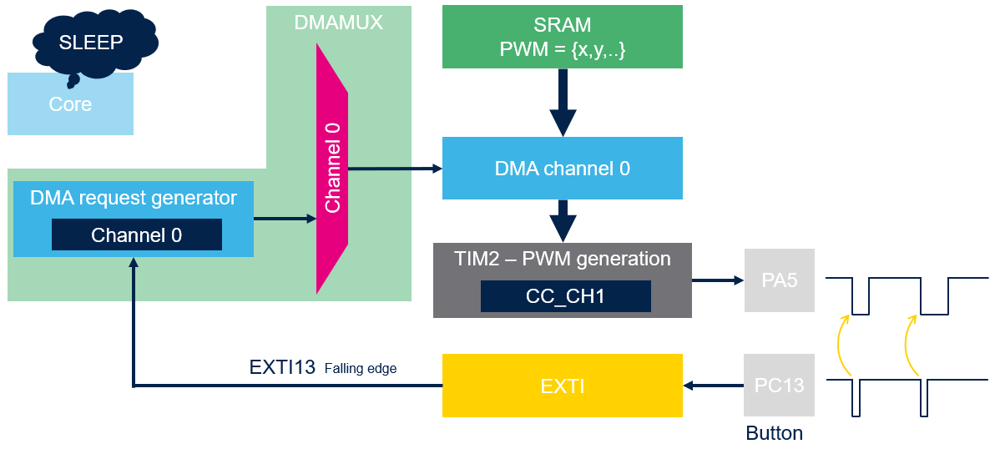

----!
Presentation
----!
# Master panel
- Powered bus with limited current
- Transmit messages and expeceted answer within defined time window

## In a Workshop
- Use **STM32U83-NUCLEO** board

- Generate low pulse with various duty cycle thanks **TIMER in PWM** mode

- PWM duty cycle reconfiguration done in background mode by DMA transfer after button press

- 0% duty cycle simulates IDLE state on BUS

- Duty cycle is monitored on LED dimming

- MCU never wakeup

- Optionally consumption profile can be verified in **STM32CubeMonitor-Power**
  
