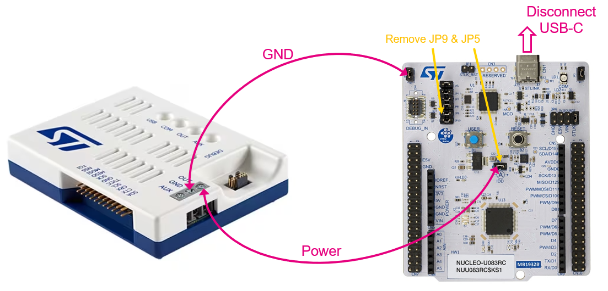
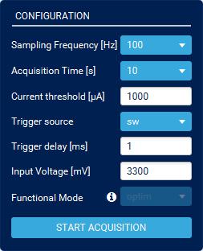

----!
Presentation
----!
# Power Monitor
For Low power application let use Power Shield feature built in STLink-V3PWR for measure purpose and display profile of consumed current in real time.

 

# STLINK-V3PWR
- Connect **two wires in position OUT & GND** as shown in picture below. 

<ainfo>
Wires can be optionally twisted to reduce noise.
</ainfo> 

 

# Connect STLINK-V3PWR
- [Install](https://www.st.com/en/development-tools/stm32cubemonpwr.html) and launch **STM32CubeMonitor-Power**

- Select **Virtual Comport** associated to STLINK-V3PWR power measuring feature.

- Press **Take Control**.

# Wiring diagram to STM32U83-NUCLEO board
- **Remove JP5** and **Remove JP9** on NUCLEO board

- Connect wires to **GND** and left **Pin 2** of **JP5**
  
- Disconnect USB-C from DK board to avoid small leakage current (unprecise current measuring) due to second ground reference.

 

- or **Connect A-meter** to Pin 1 & 2 of JP5. Then keep NUCLEO board power from USB-C and do not disconect it. 
  
 

# Configuration
In Configuration window many parameters can be adjusted. For hands-on purpose let select:

- **Sampling frequency to 10kHz** to get adequate resolution

- **Acquisition time set to infinitive** – endless data recording

- Keep **3300mV** as output voltage level

- Press **POWER ON** - both LEDs (AUX and OUT) light Green

- **Start Acquisition**.

# Show report
- FULL and SELECT FRAME consumption details (Min, Max, Average, Energy)
- Acqusition must be **stoped**
- Press **Show Report**

