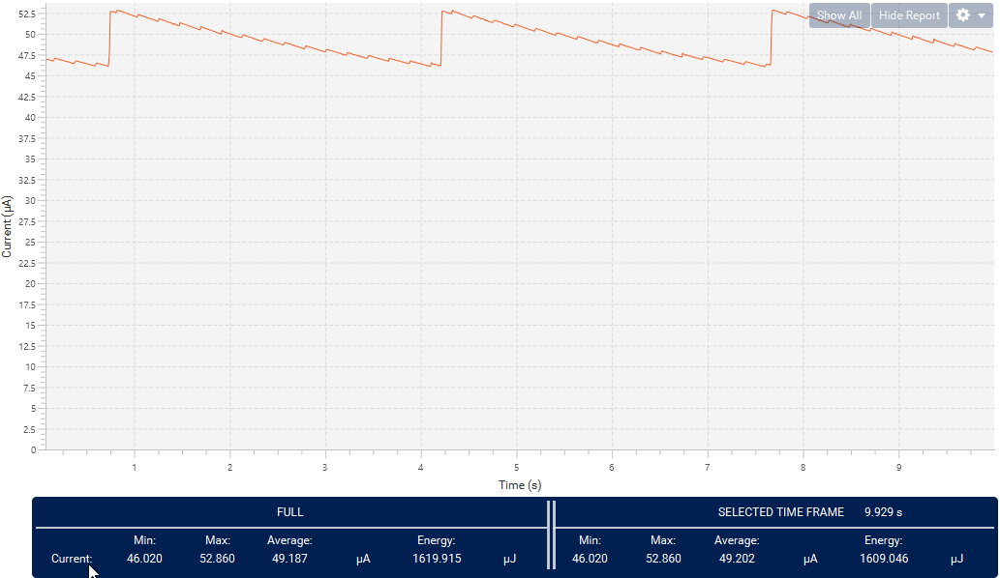

----!
Presentation
----!

# Test Functionality
Check functionality we developt in past 30 minutes!

- Supply Nucelo board
- After every press blue user button Duty cycle of Low pulse is changed
- Visible change in **LED brightness**

## Measure consumption in LP Sleep
- Consumption **50uA** for LP Sleep mode and PWM operation
- Triangle wave due to Low Power regulator operation

