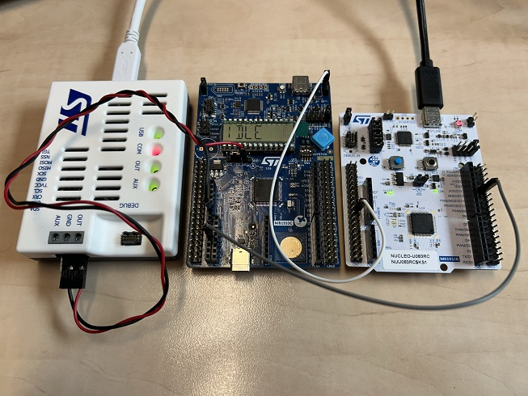

## Achieved results
**Master Panel**
 
Consumption was measured in LP Sleep mode, resulting in a measured consumption of ~49 uA for LP Sleep mode @1MHz and PWM operation @200Hz. The measured results match with DataSheet typical characteristics.

**End Device**
 
Measured consumption in the IDLE state on the BUS, with an average consumption of ~8?? uA in STOP1 mode while driving the LCD and keeping LPTIM and RTC active.
Measured consumption in the non-IDLE state on the BUS, with an average consumption of ~29?? uA, involving a combination of STOP1 and LP Run in ISR for data processing.

## Conclusion

The session provided a comprehensive overview of the practical implementation of a low-power BUS system, covering both the Master Panel and the End Device functionalities using the STM32U83-NUCLEO and STM32U83-DK boards.The demonstrated exercises and test functionality showcased the real-world application of low-power BUS systems, emphasizing the importance of managing power consumption and communication integrity in a low-power environment.

Because **[Our technology starts with You!](https://www.st.com)**

